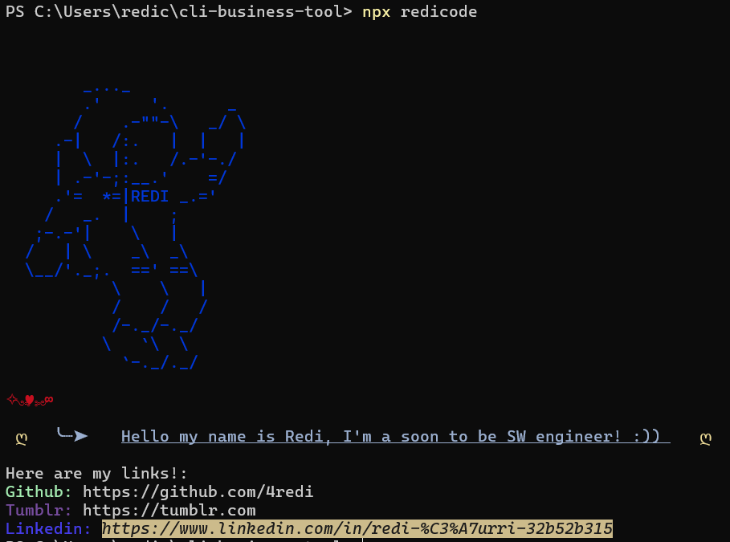

# -ˋˏ ✄┈┈  4REDI npm Package -ˋˏ




# ꒰ᐢ. .ᐢ꒱ Project journey
After thinking it for a while and reading the chalk documentatio, i decided to create something mine. On codeblr i also saw some inspirations. This project took me about 2 hours. After doing some research i decided to publish it online!

# ᯓ★ Links to check

⤷ My npm package : [LINK](https://www.npmjs.com/package/cli-business-tool)

⤷ Learn about Chalk (so you can make your texts colorful like mine) : [LINK](https://www.npmjs.com/package/chalk)

⤷ Add your own ASCII art and make it rock! : [LINK](https://www.asciiart.eu/)

# ˚ ༘ ೀ⋆｡˚ Usage

To use my npm "cli-business-tool" package, do these steps:

1. Open the terminal ose command prompt 
2. Run the following command: 
```bash
 npm i cli-business-tool 
 ```
3. Then type: 
```bash
npx redicode
```
<br>


# જ⁀➴ Contact me
If you have any suggestions,tips on how to improve and make it better contact me on my socials :).